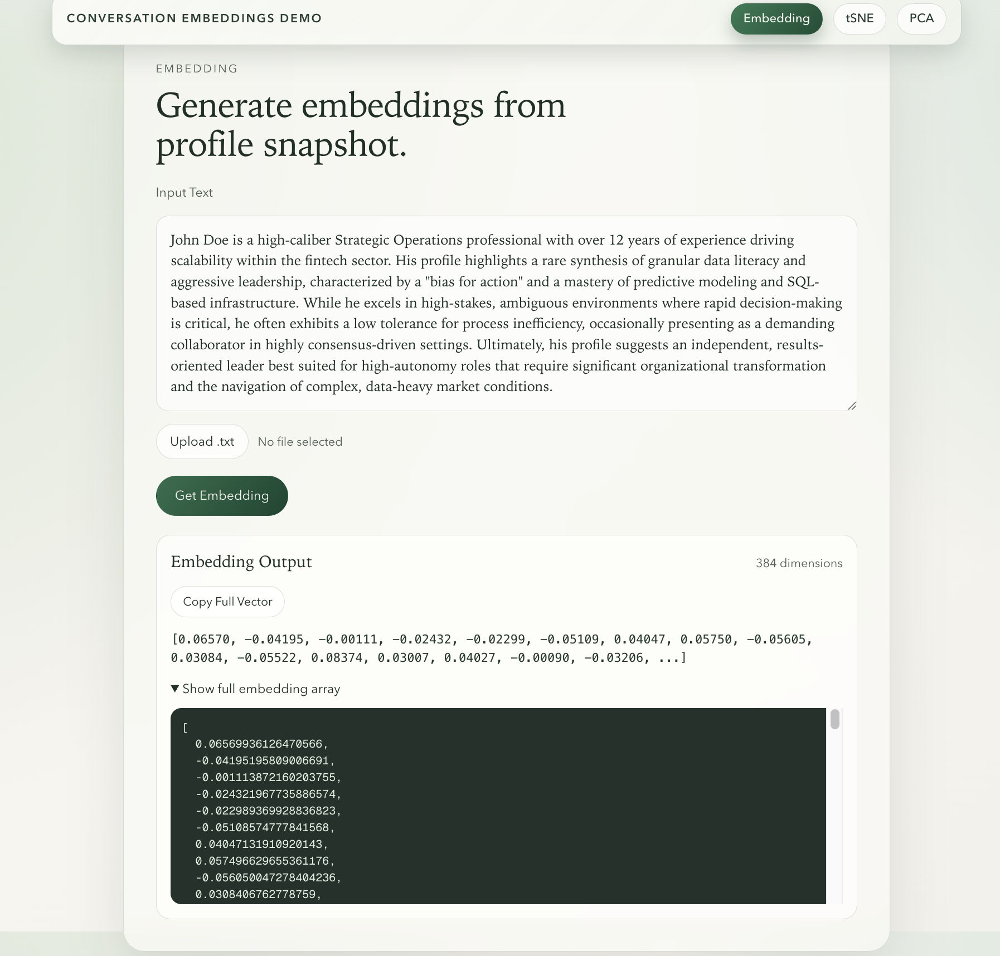
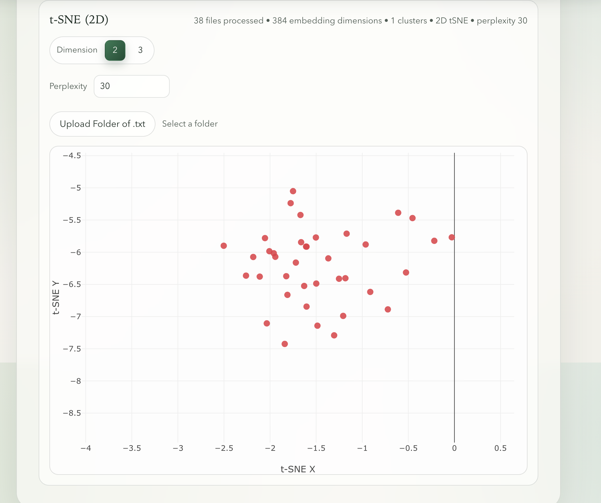
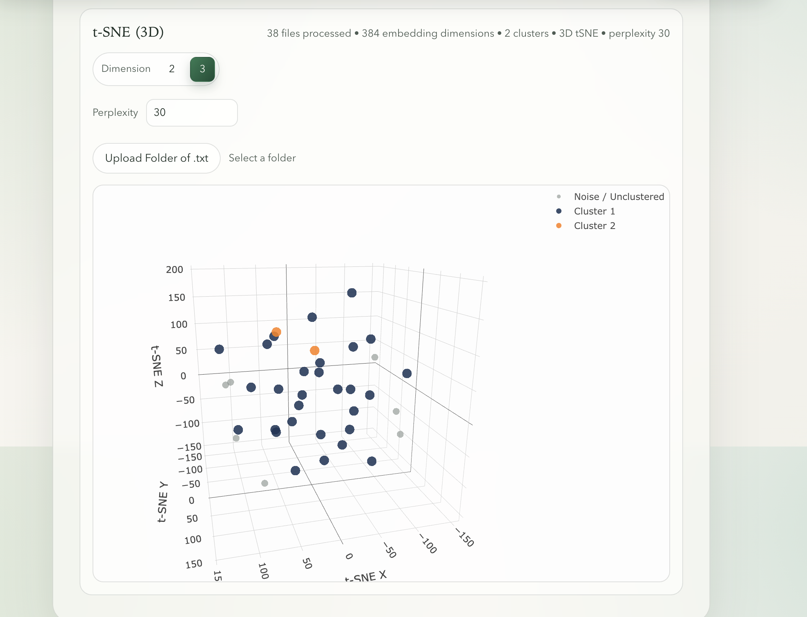
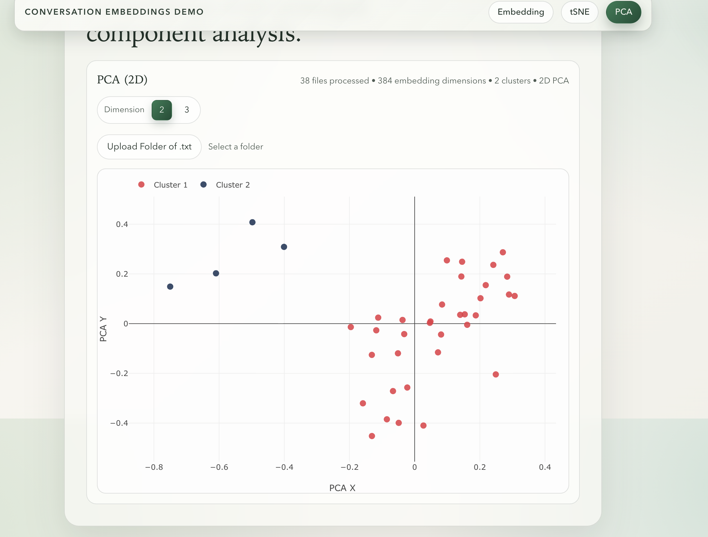
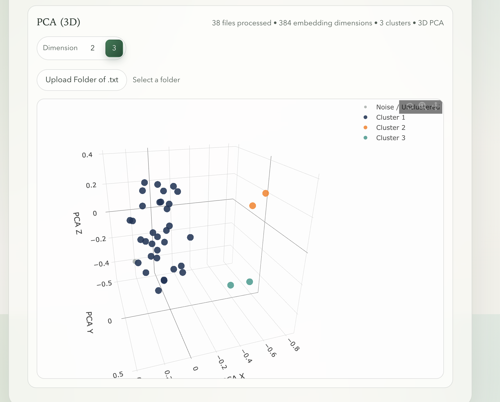

# Conversation Embeddings Demo

This project is a full-stack demo for generating and exploring text embeddings.

It has 3 main views:
- Embedding: generate a vector for a single pasted text or uploaded `.txt` file.
- tSNE: upload a folder of `.txt` files, project embeddings into 2D/3D t-SNE, and inspect clusters.
- PCA: upload a folder of `.txt` files, project embeddings into 2D/3D PCA, and inspect clusters.

## What The Demo Does

### 1) Single Embedding Generation
- Frontend sends text to `POST /api/getEmbedding`.
- Backend uses `sentence-transformers/all-MiniLM-L6-v2` to produce an embedding vector.
- UI shows preview + full JSON vector output and lets you copy the vector.

### 2) t-SNE Projection + Clustering
- Frontend sends folder documents to `POST /api/getEmbeddingsTsne3d`.
- Request supports:
  - `tsneDimensions` (`2` or `3`)
  - `tsnePerplexity` (user input; backend clamps to valid range)
- Backend runs t-SNE with:
  - cosine metric
  - fixed random state for reproducibility
- Points are clustered with DBSCAN and displayed by cluster color.

### 3) PCA Projection + Clustering
- Frontend sends folder documents to `POST /api/getEmbeddingsPca`.
- Request supports `pcaDimensions` (`2` or `3`).
- Backend runs PCA projection and DBSCAN clustering.
- Results are shown in interactive 2D/3D Plotly charts.

## Tech Stack
- Frontend: Next.js (App Router), React, TypeScript, Plotly
- Backend: FastAPI, sentence-transformers, scikit-learn, NumPy
- Model: `all-MiniLM-L6-v2`

## Run Locally

### Backend
From project root:

```bash
cd backend
python -m venv .venv
source .venv/bin/activate
pip install -r requirements.txt
fastapi dev main.py --port 8000
```

### Frontend
In a separate terminal:

```bash
cd frontend
npm install
npm run dev -- --port 3000
```

If needed, set frontend API base URL:

```bash
export NEXT_PUBLIC_API_BASE_URL=http://localhost:8000
```

Then open `http://localhost:3000`.

## API Endpoints
- `POST /api/getEmbedding`
- `POST /api/getEmbeddingsTsne3d`
- `POST /api/getEmbeddingsPca`

## Demo Screenshots

### Main Embedding View


### t-SNE 2D


### t-SNE 3D


### PCA 2D


### PCA 3D

